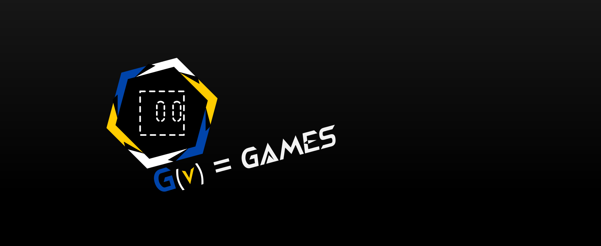

# GDV Engine

GDV Engine is a graphics engine under development for the creation of 3D graphics. This project is focused on combining the power of C++ and OpenGL with a cross-platform graphics editor developed in C# using Uno Platform.

## Project Vision

GDV Engine aims to become a complete and accessible tool for game and graphics application developers. As it evolves, we plan to include:

-   Dynamic shadows and advanced lighting systems.
-   Physics-based rendering (PBR).
-   Support for animations and physics.
-   Project export to multiple platforms.
-   An active community for extensions and add-ons.

## How to Contribute

The project is open to contributions from the community. If you are interested in contributing:

1. Make a fork of the repository.
2. Create a branch with your functionality or bug fixes.
3. Open a Pull Request with a detailed description of your changes.
